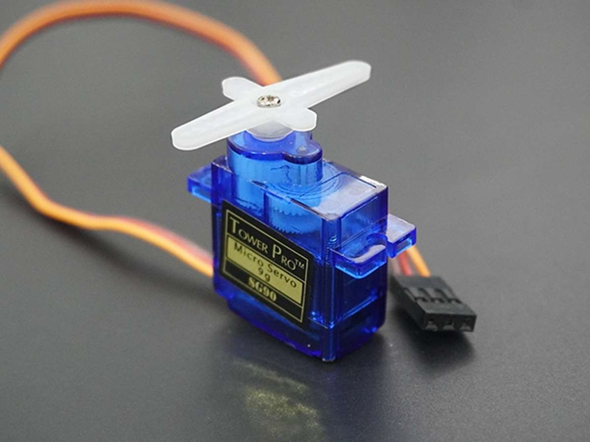

### 1. Arduino Uno board

|**ລາຍລະອຽດ**|**ຄໍາອະທິບາຍ**|
|---|---|
|**1. ອຸປະກອນນີ້ແມ່ນຫຍັງ?**||**Arduino Uno** ແມ່ນແຜງໄມໂຄຣຄອນໂທນເລີ (Microcontroller Board) ແບບ open-source ທີ່ສ້າງຂຶ້ນເທິງຊິບ **ATmega328P**1. ມັນເຮັດໜ້າທີ່ເປັນສະໝອງຫຼັກສຳລັບໂຄງການເອເລັກໂຕຣນິກ, ອະນຸຍາດໃຫ້ຜູ້ໃຊ້ສາມາດຂຽນໂປຣແກຣມ ແລະ ໂຕ້ຕອບກັບໂລກພາຍນອກ2.|
|**2. ການໃຊ້ງານຂອງອຸປະກອນເຮັດວຽກແນວໃດ?**|ມັນເຮັດວຽກໂດຍການອ່ານການປ້ອນຂໍ້ມູນ (ເຊັ່ນ: ແສງຈາກເຊັນເຊີ ຫຼື ການກົດປຸ່ມ) 3ແລະ ປ່ຽນເປັນການສົ່ງອອກ (ເຊັ່ນ: ການເປີດໄຟ LED ຫຼື ການເດີນຂອງມໍເຕີ) 4, ໂດຍອີງຕາມຄໍາສັ່ງ (sketch) ທີ່ບັນທຶກໄວ້ໃນໜ່ວຍຄວາມຈຳຂອງມັນ5.|
|**3. ຂໍ້ມູນລາຍລະອຽດອຸປະກອນ**||**ຊື່ອຸປະກອນ:** Arduino Uno board 6 **ຮູບພາບຕົວຈິງ:** (ໃສ່ຮູບພາບຈິງຂອງ Arduino Uno ຢູ່ບ່ອນນີ້) **ແຜນວາດ Pinout:** (ໃສ່ຮູບແຜນວາດ Pinout) * **Digital Pins (0-13):** ໃຊ້ສຳລັບການປ້ອນຂໍ້ມູນ/ສົ່ງອອກແບບດິຈິຕອລ (ON/OFF). Pins 3, 5, 6, 9, 10, ແລະ 11 ຮອງຮັບ PWM (Pseudo-Analog). * **Analog Pins (A0-A5):** ໃຊ້ສຳລັບການອ່ານຄ່າອະນາລັອກ (ຕົວຢ່າງ: ຈາກເຊັນເຊີອຸນຫະພູມ). * **Power Pins (GND, 5V, 3.3V):** ໃຊ້ສຳລັບການເຊື່ອມຕໍ່ກັບພື້ນດິນ ແລະ ການສະໜອງພະລັງງານໃຫ້ອຸປະກອນອື່ນ. * **Etc...:** Microcontroller: ATmega328P, ໂວນເຮັດວຽກ: 5V, ຄວາມໄວໂມງ: 16 MHz.|
|**4. ຕົວຢ່າງການນໍາໃຊ້:**|**ການສ້າງລະບົບໄຟສັນຍານຈາລະຈອນແບບງ່າຍດາຍ (Simple Traffic Light System)**|

---

### 2. Breadboards

|**ລາຍລະອຽດ**|**ຄໍາອະທິບາຍ**|
|---|---|
|**1. ອຸປະກອນນີ້ແມ່ນຫຍັງ?**||**Breadboard** ແມ່ນແຜງພລາສຕິກທີ່ມີຮູ, ໃຊ້ສຳລັບການສ້າງແບບຈຳລອງ (prototype) ວົງຈອນເອເລັກໂຕຣນິກຊົ່ວຄາວ7. ມັນຊ່ວຍໃຫ້ສາມາດເຊື່ອມຕໍ່ອຸປະກອນຕ່າງໆໄດ້ໂດຍບໍ່ຈຳເປັນຕ້ອງມີການເຊື່ອມ.|
|**2. ການໃຊ້ງານຂອງອຸປະກອນເຮັດວຽກແນວໃດ?**|ພາຍໃນ breadboard, ແຖວຂອງຮູຖືກເຊື່ອມຕໍ່ທາງດ້ານໄຟຟ້າ: * **ລາງພະລັງງານ (Power Rails):** ແຖວຕາມລວງຍາວທັງໝົດ (ປົກກະຕິແມ່ນໝາຍດ້ວຍ + ແລະ -) ແມ່ນເຊື່ອມຕໍ່ກັນ. * **ລາງວົງຈອນ (Component Area):** ຫ້າຮູໃນແຕ່ລະຖັນຕາມລວງນອນຖືກເຊື່ອມຕໍ່ກັນ. ທ່ານສາມາດໃສ່ສາຍ ຫຼື ສ່ວນປະກອບຕ່າງໆເຂົ້າໄປໃນຮູເຫຼົ່ານີ້ເພື່ອເຮັດໃຫ້ວົງຈອນສົມບູນ.|
|**3. ຂໍ້ມູນລາຍລະອຽດອຸປະກອນ**||**ຊື່ອຸປະກອນ:** Breadboards 8 **ຮູບພາບຕົວຈິງ:** (ໃສ່ຮູບພາບຈິງຂອງ Breadboard ຢູ່ບ່ອນນີ້)|
### 3. USB cable

|**ລາຍລະອຽດ**|**ຄໍາອະທິບາຍ**|
|---|---|
|**1. ອຸປະກອນນີ້ແມ່ນຫຍັງ?**||**ສາຍ USB (USB Cable)** ແມ່ນໃຊ້ສຳລັບເຊື່ອມຕໍ່ Arduino Uno ກັບຄອມພິວເຕີ9. ປົກກະຕິແລ້ວມັນຈະເປັນສາຍປະເພດ **USB A ຫາ USB B** (ສຳລັບ Uno).|
|**2. ການໃຊ້ງານຂອງອຸປະກອນເຮັດວຽກແນວໃດ?**|ສາຍ USB ເຮັດສອງໜ້າທີ່ຫຼັກຄື: * **ພະລັງງານ (Power):** ມັນສະໜອງພະລັງງານ 5V ໃຫ້ກັບ Arduino Uno ຈາກຄອມພິວເຕີ. * **ຂໍ້ມູນ (Data):** ມັນສ້າງຊ່ອງທາງການສື່ສານແບບ serial ເພື່ອອັບໂຫລດລະຫັດຈາກຄອມພິວເຕີໄປຫາ Arduino ແລະ ສົ່ງຂໍ້ມູນ serial ກັບຄືນໄປຫາຄອມພິວເຕີ (Serial Monitor).|
|**3. ຂໍ້ມູນລາຍລະອຽດອຸປະກອນ**||**ຊື່ອຸປະກອນ:** USB cable 10 **ຮູບພາບຕົວຈິງ:** (ໃສ່ຮູບພາບຈິງຂອງສາຍ USB A ຫາ B) **ແຜນວາດ Pinout (Diagram):** (ໃສ່ແຜນວາດ pinout ພື້ນຖານຂອງ USB B connector) * **Pins:** VCC (5V), Data- (D-), Data+ (D+), Ground (GND). * **Etc...:** ໃຊ້ສຳລັບການອັບໂຫລດ sketch (ໂປຣແກຣມ) ໄປຫາ Arduino.|
|**4. ຕົວຢ່າງການນໍາໃຊ້:**|**ການອັບໂຫລດໂຄງການ "Blink" ໄປຫາ Arduino Uno**|

---

### 4. Jumper wires (male-to-male)

|**ລາຍລະອຽດ**|**ຄໍາອະທິບາຍ**|
|---|---|
|**1. ອຸປະກອນນີ້ແມ່ນຫຍັງ?**||**ສາຍ Jumper wires (Male-to-Male)** 11 ແມ່ນສາຍທີ່ມີເຂັມປັກຢູ່ທັງສອງສົ້ນ. ມັນຖືກນໍາໃຊ້ເພື່ອສ້າງການເຊື່ອມຕໍ່ທາງດ້ານໄຟຟ້າຊົ່ວຄາວລະຫວ່າງສອງຈຸດໃນວົງຈອນ.|
|**2. ການໃຊ້ງານຂອງອຸປະກອນເຮັດວຽກແນວໃດ?**|ພວກມັນຖືກໃຊ້ໂດຍສະເພາະເພື່ອເຊື່ອມຕໍ່: * **ຈຸດຕ່າງໆໃນ Breadboard:** ເຂັມປັກເໝາະກັບຮູຂອງ breadboard. * **Arduino Pins ກັບ Breadboard:** ເຊັ່ນ: ເຊື່ອມຕໍ່ Pin ດິຈິຕອລຂອງ Arduino ກັບຈຸດໃນ breadboard.|
|**3. ຂໍ້ມູນລາຍລະອຽດອຸປະກອນ**||**ຊື່ອຸປະກອນ:** Jumper wires (male-to-male) 12**ຮູບພາບຕົວຈິງ:** (ໃສ່ຮູບພາບຈິງຂອງສາຍ Male-to-Male) **ແຜນວາດ Pinout (Diagram):** (ບໍ່ມີ pinout ສະເພາະ, ແຕ່ອະທິບາຍປາຍ) * **ປາຍ:** ທັງສອງສົ້ນມີເຂັມປັກ ("Male" pins)13. * **Etc...:** ມີຫຼາຍສີ ແລະ ຫຼາຍຄວາມຍາວ, ໃຊ້ສຳລັບການເຊື່ອມຕໍ່ສັນຍານ ແລະ ພະລັງງານພາຍໃນ breadboard.|
|**4. ຕົວຢ່າງການນໍາໃຊ້:**|**ການເຊື່ອມຕໍ່ GND ແລະ 5V ຂອງ Arduino ໄປຫາລາງພະລັງງານຂອງ Breadboard**|

---

### 5. Jumper wires (male-to-female)

|**ລາຍລະອຽດ**|**ຄໍາອະທິບາຍ**|
|---|---|
|**1. ອຸປະກອນນີ້ແມ່ນຫຍັງ?**||**ສາຍ Jumper wires (Male-to-Female)** 14 ມີເຂັມປັກຢູ່ສົ້ນໜຶ່ງ (Male) ແລະ ຫົວເຊື່ອມຕໍ່ແບບເຕົ້າສຽບຢູ່ອີກສົ້ນໜຶ່ງ (Female).|
|**2. ການໃຊ້ງານຂອງອຸປະກອນເຮັດວຽກແນວໃດ?**|ພວກມັນມີປະໂຫຍດຢ່າງຍິ່ງສຳລັບ: * **ການເຊື່ອມຕໍ່ Breadboard ກັບ Pin headers ຂອງ Module:** ປາຍ Female ທີ່ເປັນເຕົ້າສຽບສາມາດສຽບເຂົ້າໄປໃນເຂັມປັກ (pins) ຂອງເຊັນເຊີ ຫຼື ໂມດູນໄດ້ໂດຍກົງ. * **ການເຊື່ອມຕໍ່ Arduino Pin Headers ກັບ Breadboard:** ປາຍ Female ສຽບໃສ່ Pin ຂອງ Arduino, ແລະ ປາຍ Male ສຽບໃສ່ Breadboard.|
|**3. ຂໍ້ມູນລາຍລະອຽດອຸປະກອນ**||**ຊື່ອຸປະກອນ:** Jumper wires (male-to-female) 15**ຮູບພາບຕົວຈິງ:** (ໃສ່ຮູບພາບຈິງຂອງສາຍ Male-to-Female) **ແຜນວາດ Pinout (Diagram):** (ບໍ່ມີ pinout ສະເພາະ, ແຕ່ອະທິບາຍປາຍ) * **ປາຍ:** ສົ້ນໜຶ່ງມີເຂັມປັກ ("Male") ແລະ ອີກສົ້ນໜຶ່ງມີເຕົ້າສຽບ ("Female")16. * **Etc...:** ຖືກໃຊ້ເພື່ອຂະຫຍາຍສາຍເຊື່ອມຕໍ່ຈາກແຜງວົງຈອນອອກໄປຫາ breadboard.|
|**4. ຕົວຢ່າງການນໍາໃຊ້:**|**ການເຊື່ອມຕໍ່ເຊັນເຊີ DHT11 (ມີ Pin Header) ໄປຫາ Arduino Uno**|
### 6. Jumper wires (female-to-female)

|**ລາຍລະອຽດ**|**ຄໍາອະທິບາຍ**|
|---|---|
|**1. ອຸປະກອນນີ້ແມ່ນຫຍັງ?**||**ສາຍ Jumper wires (Female-to-Female)** ແມ່ນສາຍທີ່ມີຫົວເຊື່ອມຕໍ່ແບບເຕົ້າສຽບຢູ່ທັງສອງສົ້ນ11. ມັນຖືກໃຊ້ເພື່ອສ້າງການເຊື່ອມຕໍ່ລະຫວ່າງເຂັມປັກສອງອັນ (male pins)22.|
|**2. ການໃຊ້ງານຂອງອຸປະກອນເຮັດວຽກແນວໃດ?**|ພວກມັນຖືກໃຊ້ໂດຍສະເພາະສຳລັບການເຊື່ອມຕໍ່: * **Pin Headers ຂອງ Module ຫາ Pin Headers ຂອງ Module:** ເຊັ່ນ: ເຊື່ອມຕໍ່ Pin ຂອງເຊັນເຊີໂດຍກົງກັບ Pin ຂອງ Arduino (ໂດຍບໍ່ຜ່ານ breadboard)33. * **ການເຊື່ອມຕໍ່ລະຫວ່າງ Arduino/Raspberry Pi:** ໃຊ້ສຳລັບການເຊື່ອມຕໍ່ແບບ point-to-point44.|
|**3. ຂໍ້ມູນລາຍລະອຽດອຸປະກອນ**||**ຊື່ອຸປະກອນ:** Jumper wires (female-to-female) 5**ຮູບພາບຕົວຈິງ:** (ໃສ່ຮູບພາບຈິງຂອງສາຍ Female-to-Female ຢູ່ບ່ອນນີ້) 66**ແຜນວາດ Pinout (Diagram):** (ບໍ່ມີ pinout ສະເພາະ, ແຕ່ອະທິບາຍປາຍ) * **ປາຍ:** ທັງສອງສົ້ນມີເຕົ້າສຽບ ("Female")77. * **Etc...:** ເໝາະສຳລັບການເຊື່ອມຕໍ່ອຸປະກອນທີ່ມີ male headers (ເຊັ່ນ: ໂມດູນເຊັນເຊີ)88.|
|**4. ຕົວຢ່າງການນໍາໃຊ້:**||**ການເຊື່ອມຕໍ່ເຊັນເຊີ Ultrasonic (HC-SR04) ກັບ Arduino** 99|

### 7. 9V Battery Connector

|**ລາຍລະອຽດ**|**ຄໍາອະທິບາຍ**|
|---|---|
|**1. ອຸປະກອນນີ້ແມ່ນຫຍັງ?**||**9V Battery Connector** ແມ່ນອຸປະກອນທີ່ເຊື່ອມຕໍ່ແບັດເຕີຣີ 9 ໂວນເຂົ້າກັບປລັກສຽບໄຟ DC (DC barrel jack) ຂອງ Arduino Uno10.|
|**2. ການໃຊ້ງານຂອງອຸປະກອນເຮັດວຽກແນວໃດ?**|ມັນອະນຸຍາດໃຫ້ Arduino Uno ໄດ້ຮັບພະລັງງານຈາກແບັດເຕີຣີ 9V, ເຮັດໃຫ້ໂຄງການສາມາດໃຊ້ງານໄດ້ໂດຍບໍ່ຈຳເປັນຕ້ອງເຊື່ອມຕໍ່ກັບຄອມພິວເຕີ ຫຼື ແຫຼ່ງພະລັງງານອື່ນໆ11.|
|**3. ຂໍ້ມູນລາຍລະອຽດອຸປະກອນ**||**ຊື່ອຸປະກອນ:** 9V Battery Connector 12**ຮູບພາບຕົວຈິງ:** (ໃສ່ຮູບພາບຈິງຂອງ Connector ຢູ່ບ່ອນນີ້) 13**ແຜນວາດ Pinout (Diagram):** (ໃສ່ແຜນວາດຂອງປລັກສຽບ DC) * **Pins:** ເສັ້ນລວດສີແດງ (+) ເຊື່ອມຕໍ່ກັບຈຸດໃຈກາງຂອງປລັກ DC, ແລະ ສີດໍາ (-) ເຊື່ອມຕໍ່ກັບດ້ານນອກ14. * **Etc...:** ໂວນປ້ອນຂໍ້ມູນນີ້ (9V) ຖືກຄວບຄຸມລົງມາເປັນ 5V ໂດຍເຄື່ອງຄວບຄຸມໂວນໃນ Arduino15.|
|**4. ຕົວຢ່າງການນໍາໃຊ້:**||**ການໃຫ້ພະລັງງານແກ່ໂຄງການທີ່ໃຊ້ງານຢູ່ (Standalone Project Power Supply)** 16|

### Basic Components

### 8. LEDs (Red: 5, Yellow: 5, Blue: 5, RGB: 1)

|**ລາຍລະອຽດ**|**ຄໍາອະທິບາຍ**|
|---|---|
|**1. ອຸປະກອນນີ້ແມ່ນຫຍັງ?**||**LED (Light Emitting Diode)** ແມ່ນອຸປະກອນ semiconductor ທີ່ປ່ອຍແສງເມື່ອກະແສໄຟຟ້າໄຫຼຜ່ານມັນໃນທິດທາງທີ່ຖືກຕ້ອງ17. ຊຸດປະກອບມີສີແດງ, ສີເຫຼືອງ, ສີຟ້າ, ແລະ LED RGB (ສາມສີໃນອັນດຽວ)18.|
|**2. ການໃຊ້ງານຂອງອຸປະກອນເຮັດວຽກແນວໃດ?**|LED ເຮັດວຽກເປັນໄດໂອດ; ໄຟຟ້າຕ້ອງໄຫຼຈາກຂາ **Anode (+) ຫາ Cathode (-)**19. ພວກມັນປ່ອຍແສງເປັນສີທີ່ແຕກຕ່າງກັນຕາມວັດສະດຸ semiconductor ທີ່ໃຊ້. LED RGB ມີສີ່ຂາ, ແຕ່ລະຂາສຳລັບສີແດງ, ສີຂຽວ, ສີຟ້າ, ແລະ ຂາທົ່ວໄປ (common)20.|
|**3. ຂໍ້ມູນລາຍລະອຽດອຸປະກອນ**||**ຊື່ອຸປະກອນ:** LEDs (Light Emitting Diodes) 21**ຮູບພາບຕົວຈິງ:** (ໃສ່ຮູບພາບ LED ມາດຕະຖານ ແລະ RGB LED) 22**ແຜນວາດ Schematic:** (ໃສ່ສັນຍາລັກຂອງ LED) * **ຂາ Anode (+):** ຂາຍາວ, ເຊື່ອມຕໍ່ກັບ 5V (ຜ່ານ Resistor)23. * **ຂາ Cathode (-):** ຂາສັ້ນ, ເຊື່ອມຕໍ່ກັບ Ground (GND)24. * **Etc...:** ຕ້ອງໃຊ້ Resistor (ເຊັ່ນ: 220Ω) ໃນຊຸດເພື່ອຈຳກັດກະແສໄຟຟ້າ ແລະ ປ້ອງກັນບໍ່ໃຫ້ LED ໄໝ້25.|
|**4. ຕົວຢ່າງການນໍາໃຊ້:**||**ການຄວບຄຸມຄວາມສະຫວ່າງຂອງ LED ດ້ວຍ PWM (Fade LED)** 26|

### 9. RGB module

|**ລາຍລະອຽດ**|**ຄໍາອະທິບາຍ**|
|---|---|
|**1. ອຸປະກອນນີ້ແມ່ນຫຍັງ?**||**RGB Module** ແມ່ນໂມດູນທີ່ບັນຈຸ LED RGB, ເຊິ່ງສາມາດຜະລິດແສງສີຕ່າງໆໄດ້ໂດຍການປະສົມຄວາມເຂັ້ມຂອງສີແດງ (Red), ສີຂຽວ (Green), ແລະ ສີຟ້າ (Blue)27. ມັນມີຕົວຕ້ານທານທີ່ຈຳກັດກະແສໄຟຟ້າໃນຕົວ.|
|**2. ການໃຊ້ງານຂອງອຸປະກອນເຮັດວຽກແນວໃດ?**|ໂດຍການໃຊ້ **Pulse Width Modulation (PWM)** ຈາກ Arduino ເພື່ອຄວບຄຸມລະດັບຄວາມເຂັ້ມແສງຂອງ LED ແຕ່ລະສີ (R, G, B), ມັນສາມາດຜະລິດສີທີ່ແຕກຕ່າງກັນໄດ້ເຖິງ 16 ລ້ານສີ28. ມັນມັກຈະເປັນແບບ **Common Cathode** (GND ທົ່ວໄປ) ຫຼື **Common Anode** (VCC ທົ່ວໄປ)29.|
|**3. ຂໍ້ມູນລາຍລະອຽດອຸປະກອນ**||**ຊື່ອຸປະກອນ:** RGB module 30**ຮູບພາບຕົວຈິງ:** (ໃສ່ຮູບພາບຈິງຂອງ RGB Module) 31**ແຜນວາດ Pinout (Diagram):** * **Pins:** R (Red), G (Green), B (Blue), ແລະ VCC (Common Anode) ຫຼື GND (Common Cathode)32. * **Etc...:** ຕ້ອງເຊື່ອມຕໍ່ກັບ Pin ຂອງ Arduino ທີ່ຮອງຮັບ PWM (~) ເພື່ອຄວບຄຸມສີ33.|
|**4. ຕົວຢ່າງການນໍາໃຊ້:**||**ການສະແດງການປ່ຽນແປງສີແບບສຸ່ມ (Rainbow Fading Effect)** 34|

### 10. Resistors (220Ω, 1kΩ, 10kΩ)

|**ລາຍລະອຽດ**|**ຄໍາອະທິບາຍ**|
|---|---|
|**1. ອຸປະກອນນີ້ແມ່ນຫຍັງ?**||**Resistor** ແມ່ນອຸປະກອນເອເລັກໂຕຣນິກສອງຂາທີ່ອອກແບບມາເພື່ອຕ້ານການໄຫຼຂອງກະແສໄຟຟ້າໃນວົງຈອນ35. ຊຸດປະກອບມີ 220Ω, 1kΩ (1,000Ω), ແລະ 10kΩ (10,000Ω)36.|
|**2. ການໃຊ້ງານຂອງອຸປະກອນເຮັດວຽກແນວໃດ?**|ພວກມັນຖືກໃຊ້ສຳລັບ: * **ການຈຳກັດກະແສໄຟຟ້າ:** (ເຊັ່ນ: 220Ω ຖືກໃຊ້ກັບ LED ເພື່ອປ້ອງກັນບໍ່ໃຫ້ມັນໄໝ້)37. * **Pull-up/Pull-down:** (ເຊັ່ນ: 10kΩ ຖືກໃຊ້ກັບປຸ່ມກົດ) ເພື່ອກຳນົດສະຖານະເລີ່ມຕົ້ນຂອງສັນຍານດິຈິຕອລ38. * **Voltage Divider:** ສອງ Resistor ຖືກໃຊ້ຮ່ວມກັນເພື່ອຫຼຸດໂວນລົງ39.|
|**3. ຂໍ້ມູນລາຍລະອຽດອຸປະກອນ**||**ຊື່ອຸປະກອນ:** Resistors 40**ຮູບພາບຕົວຈິງ:** (ໃສ່ຮູບພາບຈິງຂອງ Resistor ແບບມີແຖບສີ) 41**ແຜນວາດ Schematic:** (ໃສ່ສັນຍາລັກຂອງ Resistor) * **ການກຳນົດຄ່າ:** ໂດຍໃຊ້ **ແຖບສີ** (Color Codes) ທີ່ຖືກພິມຢູ່ເທິງຕົວຕ້ານທານ42. * **Etc...:** ຫົວໜ່ວຍວັດແທກແມ່ນ **Ohm ($\Omega$)**43.|
|**4. ຕົວຢ່າງການນໍາໃຊ້:**||**ການໃຊ້ Resistor 10kΩ ເປັນ Pull-down ກັບ Push Button** 44|

### 11. Push Buttons (x4 with Lids)

|**ລາຍລະອຽດ**|**ຄໍາອະທິບາຍ**|
|---|---|
|**1. ອຸປະກອນນີ້ແມ່ນຫຍັງ?**||**Push Button** ແມ່ນສະວິດຊົ່ວຄາວທີ່ປິດ ຫຼື ເປີດວົງຈອນໃນຂະນະທີ່ມັນຖືກກົດ ແລະ ກັບຄືນສູ່ສະຖານະເດີມເມື່ອຖືກປ່ອຍ45.|
|**2. ການໃຊ້ງານຂອງອຸປະກອນເຮັດວຽກແນວໃດ?**|ມັນເຮັດວຽກໂດຍການປ່ຽນແປງສະຖານະຂອງການປ້ອນຂໍ້ມູນດິຈິຕອລຂອງ Arduino. ໂດຍປົກກະຕິແລ້ວມັນຈະຖືກໃຊ້ໃນການເຊື່ອມຕໍ່ແບບ **Pull-down** (ໃຫ້ຄ່າ LOW ເມື່ອບໍ່ຖືກກົດ) ຫຼື **Pull-up** (ໃຫ້ຄ່າ HIGH ເມື່ອບໍ່ຖືກກົດ)46.|
|**3. ຂໍ້ມູນລາຍລະອຽດອຸປະກອນ**||**ຊື່ອຸປະກອນ:** Push Buttons (with Lids) 47**ຮູບພາບຕົວຈິງ:** (ໃສ່ຮູບພາບຈິງຂອງປຸ່ມກົດແບບ 4-pin) 48**ແຜນວາດ Schematic:** (ໃສ່ສັນຍາລັກຂອງສະວິດຊົ່ວຄາວ) * **Pins:** ມີ 4 Pins, ສອງຄູ່ຂອງ Pin ທີ່ກົງກັນຂ້າມຖືກເຊື່ອມຕໍ່ເຂົ້າກັນເມື່ອບໍ່ຖືກກົດ, ແລະ ທັງ 4 Pin ເຊື່ອມຕໍ່ກັນເມື່ອຖືກກົດ49. * **Etc...:** ຝາປິດ (Lids) ຖືກໃຊ້ເພື່ອເຮັດໃຫ້ການກົດງ່າຍຂຶ້ນ ແລະ ສວຍງາມຂຶ້ນ50.|
|**4. ຕົວຢ່າງການນໍາໃຊ້:**||**ການຄວບຄຸມ LED ໂດຍການກົດປຸ່ມ (Button-Controlled LED)** 51|

### 12. Potentiometer (5KΩ)

|**ລາຍລະອຽດ**|**ຄໍາອະທິບາຍ**|
|---|---|
|**1. ອຸປະກອນນີ້ແມ່ນຫຍັງ?**||**Potentiometer** ແມ່ນຕົວຕ້ານທານທີ່ປັບໄດ້ສາມຂາ, ໂດຍປົກກະຕິແລ້ວແມ່ນ 5kΩ52. ມັນຖືກໃຊ້ເພື່ອຄວບຄຸມຄ່າຄວາມຕ້ານທານແບບປັບໄດ້ ຫຼື ເປັນຕົວແບ່ງໂວນທີ່ປັບໄດ້53.|
|**2. ການໃຊ້ງານຂອງອຸປະກອນເຮັດວຽກແນວໃດ?**|ໂດຍການໝູນລູກບິດ, ຄວາມຕ້ານທານລະຫວ່າງປາຍກາງ (wiper) ແລະ ປາຍທັງສອງສົ້ນຈະປ່ຽນແປງ54. ເມື່ອເຊື່ອມຕໍ່ກັບ 5V ແລະ GND, ປາຍກາງຈະສົ່ງອອກໂວນທີ່ແຕກຕ່າງກັນ (0V ຫາ 5V), ເຊິ່ງ Arduino ສາມາດອ່ານໄດ້ຜ່ານ Pin ອະນາລັອກ (Analog Pin)55.|
|**3. ຂໍ້ມູນລາຍລະອຽດອຸປະກອນ**||**ຊື່ອຸປະກອນ:** Potentiometer (5kΩ) 56**ຮູບພາບຕົວຈິງ:** (ໃສ່ຮູບພາບຈິງຂອງ Potentiometer) 57**ແຜນວາດ Schematic:** (ໃສ່ສັນຍາລັກຂອງ Potentiometer) * **Pins:** VCC (ເຊື່ອມຕໍ່ກັບ 5V), GND (ເຊື່ອມຕໍ່ກັບ Ground), ແລະ **Output** (ເຊື່ອມຕໍ່ກັບ Analog Pin ຂອງ Arduino)58. * **Etc...:** ເຮັດໜ້າທີ່ເປັນຕົວຄວບຄຸມການປ້ອນຂໍ້ມູນແບບອະນາລັອກ (ປ່ຽນແປງຕໍ່ເນື່ອງ)59.|
|**4. ຕົວຢ່າງການນໍາໃຊ້:**||**ການໃຊ້ Potentiometer ເພື່ອຄວບຄຸມຄວາມໄວຂອງ Servo Motor** 60|

### 13. Active Buzzer

|**ລາຍລະອຽດ**|**ຄໍາອະທິບາຍ**|
|---|---|
|**1. ອຸປະກອນນີ້ແມ່ນຫຍັງ?**||**Active Buzzer** ແມ່ນລຳໂພງ piezoelectric ຂະໜາດນ້ອຍທີ່ມີວົງຈອນກຳເນີດສຽງ (oscillator) ໃນຕົວ61.|
|**2. ການໃຊ້ງານຂອງອຸປະກອນເຮັດວຽກແນວໃດ?**|ມັນຜະລິດສຽງ (tone) ທີ່ຄວາມຖີ່ຄົງທີ່ເມື່ອໄດ້ຮັບໂວນ DC ທີ່ຖືກຕ້ອງ (ເຊັ່ນ: 5V)62. ມັນງ່າຍຕໍ່ການໃຊ້ງານ, ເພາະມັນພຽງແຕ່ຕ້ອງການສັນຍານ HIGH/LOW ຈາກ Arduino ເພື່ອເປີດ/ປິດສຽງ63.|
|**3. ຂໍ້ມູນລາຍລະອຽດອຸປະກອນ**||**ຊື່ອຸປະກອນ:** Active Buzzer 64**ຮູບພາບຕົວຈິງ:** (ໃສ່ຮູບພາບຈິງຂອງ Active Buzzer) 65**ແຜນວາດ Pinout (Diagram):** * **Pins:** VCC (+) ແລະ GND (-)66. * **Etc...:** ບໍ່ສາມາດປັບຄວາມຖີ່ຂອງສຽງໄດ້, ພຽງແຕ່ສາມາດເປີດ ຫຼື ປິດໄດ້67.|
|**4. ຕົວຢ່າງການນໍາໃຊ້:**||**ການສ້າງສຽງເຕືອນ (Simple Alarm Sound)** 68|

### 14. Passive Buzzer

|**ລາຍລະອຽດ**|**ຄໍາອະທິບາຍ**|
|---|---|
|**1. ອຸປະກອນນີ້ແມ່ນຫຍັງ?**||**Passive Buzzer** ແມ່ນລຳໂພງ piezoelectric ຂະໜາດນ້ອຍທີ່ບໍ່ມີວົງຈອນກຳເນີດສຽງໃນຕົວ69. ມັນຕ້ອງການສັນຍານຄື້ນສີ່ຫຼ່ຽມ (square wave) ຈາກພາຍນອກເພື່ອສ້າງສຽງ70.|
|**2. ການໃຊ້ງານຂອງອຸປະກອນເຮັດວຽກແນວໃດ?**|Arduino ຕ້ອງໃຊ້ຟັງຊັນ **`tone()`** ເພື່ອສົ່ງສັນຍານຄື້ນສີ່ຫຼ່ຽມທີ່ຄວາມຖີ່ທີ່ແຕກຕ່າງກັນໄປຫາ Passive Buzzer71. ນີ້ອະນຸຍາດໃຫ້ມັນສາມາດຜະລິດສຽງ (tones) ທີ່ຫຼາກຫຼາຍ ແລະ ສາມາດຫຼິ້ນເພງໄດ້72.|
|**3. ຂໍ້ມູນລາຍລະອຽດອຸປະກອນ**||**ຊື່ອຸປະກອນ:** Passive Buzzer 73**ຮູບພາບຕົວຈິງ:** (ໃສ່ຮູບພາບຈິງຂອງ Passive Buzzer) 74**ແຜນວາດ Pinout (Diagram):** * **Pins:** VCC (+) ແລະ GND (-)75. * **Etc...:** ຕ້ອງເຊື່ອມຕໍ່ກັບ Digital Pin ຂອງ Arduino76. ຄວາມສາມາດໃນການປັບຄວາມຖີ່ຂອງສຽງແມ່ນຂໍ້ໄດ້ປຽບຫຼັກ77.|
|**4. ຕົວຢ່າງການນໍາໃຊ້:**||**ການຫຼິ້ນເພງງ່າຍໆ (Playing Simple Tunes/Music)** 78|

### Displays & Output

### 15. 16x2 LCD display

|**ລາຍລະອຽດ**|**ຄໍາອະທິບາຍ**|
|---|---|
|**1. ອຸປະກອນນີ້ແມ່ນຫຍັງ?**||**16x2 LCD Display** ແມ່ນຈໍສະແດງຜົນຂໍ້ຄວາມທີ່ສາມາດສະແດງຕົວອັກສອນໄດ້ 16 ຕົວອັກສອນໃນ 2 ແຖວ79.|
|**2. ການໃຊ້ງານຂອງອຸປະກອນເຮັດວຽກແນວໃດ?**|ໂດຍປົກກະຕິແລ້ວມັນຈະສື່ສານກັບ Arduino ໂດຍໃຊ້ໂໝດ 4-bit ຫຼື 8-bit80. ມັນຕ້ອງມີການເຊື່ອມຕໍ່ສາຍໄຟຫຼາຍສາຍກັບ Arduino (ເຊັ່ນ: 6-12 ສາຍ) ແລະ ມັກຈະໃຊ້ Potentiometer ເພື່ອປັບຄວາມຄົມຊັດ81.|
|**3. ຂໍ້ມູນລາຍລະອຽດອຸປະກອນ**||**ຊື່ອຸປະກອນ:** 16x2 LCD display 82**ຮູບພາບຕົວຈິງ:** (ໃສ່ຮູບພາບຈິງຂອງ 16x2 LCD) 83**ແຜນວາດ Pinout (Diagram):** * **Pins:** VSS, VDD, VO (Contrast), RS, RW, E, D0-D7, LED+ (Backlight)84. * **Etc...:** ຕ້ອງການຫ້ອງສະໝຸດ **LiquidCrystal** ຂອງ Arduino ເພື່ອຄວບຄຸມ85.|
|**4. ຕົວຢ່າງການນໍາໃຊ້:**||**ການສະແດງຄ່າອຸນຫະພູມທີ່ອ່ານໄດ້ຈາກ LM35** 86|

### 16. I2C Serial Adapter board module

|**ລາຍລະອຽດ**|**ຄໍາອະທິບາຍ**|
|---|---|
|**1. ອຸປະກອນນີ້ແມ່ນຫຍັງ?**||**I2C Serial Adapter board module** ແມ່ນໂມດູນທີ່ຕິດຕັ້ງຢູ່ດ້ານຫຼັງຂອງ 16x2 LCD ເພື່ອແປງການສື່ສານແບບ Parallel ຂອງ LCD ໃຫ້ເປັນການສື່ສານແບບ I2C Serial87.|
|**2. ການໃຊ້ງານຂອງອຸປະກອນເຮັດວຽກແນວໃດ?**|ມັນໃຊ້ໂປຣໂຕຄໍ I2C, ເຊິ່ງຕ້ອງການພຽງແຕ່ **ສອງສາຍ** (SDA - Data ແລະ SCL - Clock) ບວກກັບ VCC ແລະ GND, ເພື່ອຄວບຄຸມ LCD88. ນີ້ຊ່ວຍປະຢັດ Pin ດິຈິຕອລສ່ວນໃຫຍ່ຂອງ Arduino ໄວ້ສຳລັບການໃຊ້ງານອື່ນ89.|
|**3. ຂໍ້ມູນລາຍລະອຽດອຸປະກອນ**||**ຊື່ອຸປະກອນ:** I2C Serial Adapter board module 90**ຮູບພາບຕົວຈິງ:** (ໃສ່ຮູບພາບຈິງຂອງໂມດູນ I2C) 91**ແຜນວາດ Pinout (Diagram):** * **Pins:** VCC, GND, SDA (Analog Pin A4 ຂອງ Uno), SCL (Analog Pin A5 ຂອງ Uno)92. * **Etc...:** ຕ້ອງການຫ້ອງສະໝຸດ **LiquidCrystal_I2C** ເພື່ອຄວບຄຸມ. ມັນມັກຈະມີຕົວປັບຄວາມຄົມຊັດ (Potentiometer) ໃນຕົວ93.|
|**4. ຕົວຢ່າງການນໍາໃຊ້:**||**ການເຊື່ອມຕໍ່ LCD 16x2 ກັບ Arduino ໂດຍໃຊ້ພຽງ 4 ສາຍ** 94|

### 17. 7-segment display (Common Cathode +)

|**ລາຍລະອຽດ**|**ຄໍາອະທິບາຍ**|
|---|---|
|**1. ອຸປະກອນນີ້ແມ່ນຫຍັງ?**||**7-Segment Display** ແມ່ນຮູບແບບການສະແດງຜົນເອເລັກໂຕຣນິກທີ່ໃຊ້ LED ເຈັດອັນ (ເຊັ່ນ: ແຕ່ລະອັນເປັນ "segment") ເພື່ອສະແດງຕົວເລກ 0 ຫາ 995. ຊຸດປະກອບມີແບບ **Common Cathode**96.|
|**2. ການໃຊ້ງານຂອງອຸປະກອນເຮັດວຽກແນວໃດ?**|ໃນແບບ **Common Cathode**, ຂາ Cathode ທັງໝົດຂອງ LED ທັງເຈັດຖືກເຊື່ອມຕໍ່ເຂົ້າກັນກັບ Ground (GND) ຜ່ານ Resistor97. ເພື່ອເຮັດໃຫ້ segment ໃດນຶ່ງສະຫວ່າງ, ທ່ານຕ້ອງສົ່ງສັນຍານ **HIGH (5V)** ໄປຫາ Pin Anode ຂອງ segment ນັ້ນ98.|
|**3. ຂໍ້ມູນລາຍລະອຽດອຸປະກອນ**||**ຊື່ອຸປະກອນ:** 7-segment display (Common Cathode) 99**ຮູບພາບຕົວຈິງ:** (ໃສ່ຮູບພາບຈິງຂອງ 7-Segment Display) 100**ແຜນວາດ Schematic:** (ໃສ່ແຜນວາດທີ່ສະແດງການຕັ້ງຄ່າ segment A-G ແລະ DP) * **Pins:** ປົກກະຕິແລ້ວແມ່ນ 10 Pins (8 segments + 2 Common)101. * **Etc...:** ຕ້ອງໃຊ້ Resistor (ເຊັ່ນ: 220Ω) ສຳລັບແຕ່ລະ segment102.|
|**4. ຕົວຢ່າງການນໍາໃຊ້:**||**ການສະແດງເຄື່ອງນັບແບບງ່າຍດາຍ (Simple Numeric Counter)** 103|

### 18. 4-Digit 7-Segment Display

|**ລາຍລະອຽດ**|**ຄໍາອະທິບາຍ**|
|---|---|
|**1. ອຸປະກອນນີ້ແມ່ນຫຍັງ?**||**4-Digit 7-Segment Display** ແມ່ນການລວມຂອງ 7-segment display ສີ່ອັນເຂົ້າກັນເພື່ອສະແດງຕົວເລກສີ່ຕົວ104.|
|**2. ການໃຊ້ງານຂອງອຸປະກອນເຮັດວຽກແນວໃດ?**|ມັນໃຊ້ເຕັກນິກທີ່ເອີ້ນວ່າ **Multiplexing** ເພື່ອຄວບຄຸມທັງສີ່ຕົວເລກ105. ໂດຍການເປີດ/ປິດແຕ່ລະຕົວເລກຢ່າງວ່ອງໄວໃນລຳດັບ (ເຊັ່ນ: ຕົວເລກ 1 > ຕົວເລກ 2 > ຕົວເລກ 3 > ຕົວເລກ 4), ຕາຂອງມະນຸດຈະຮັບຮູ້ວ່າພວກມັນສະແດງຜົນພ້ອມກັນ106.|
|**3. ຂໍ້ມູນລາຍລະອຽດອຸປະກອນ**||**ຊື່ອຸປະກອນ:** 4-Digit 7-Segment Display 107**ຮູບພາບຕົວຈິງ:** (ໃສ່ຮູບພາບຈິງຂອງ 4-Digit Display) 108**ແຜນວາດ Pinout (Diagram):** * **Pins:** ມີ 8 Segment Pins ແລະ 4 Digit Control Pins109. * **Etc...:** ມັກຈະມາພ້ອມກັບ Chip Driver (ເຊັ່ນ: TM1637) ທີ່ເຮັດໃຫ້ການເຊື່ອມຕໍ່ງ່າຍຂຶ້ນ (ໃຊ້ພຽງ 2 ຫາ 3 ສາຍ)110.|
|**4. ຕົວຢ່າງການນໍາໃຊ້:**||**ການສ້າງໂມງດິຈິຕອລ (Digital Clock)** 111|

### 19. 8x8 Dot Matrix display

|**ລາຍລະອຽດ**|**ຄໍາອະທິບາຍ**|
|---|---|
|**1. ອຸປະກອນນີ້ແມ່ນຫຍັງ?**||**8x8 Dot Matrix Display** ແມ່ນຈໍສະແດງຜົນທີ່ປະກອບດ້ວຍໄຟ LED 64 ດອກ ທີ່ຈັດຢູ່ໃນຮູບແບບຕາຂ່າຍ 8 ແຖວ x 8 ຖັນ112.|
|**2. ການໃຊ້ງານຂອງອຸປະກອນເຮັດວຽກແນວໃດ?**|ມັນຍັງໃຊ້ເຕັກນິກ **Multiplexing** ເພື່ອຄວບຄຸມ LED 64 ດອກດ້ວຍຈໍານວນ Pin ທີ່ຈຳກັດ (ເຊັ່ນ: 16 Pin)113. ແຕ່ລະຈຸດ (Dot) ຖືກຄວບຄຸມໂດຍການສົ່ງສັນຍານໄປຫາແຖວ ແລະ ຖັນທີ່ກົງກັນ114.|
|**3. ຂໍ້ມູນລາຍລະອຽດອຸປະກອນ**||**ຊື່ອຸປະກອນ:** 8x8 Dot Matrix display 115**ຮູບພາບຕົວຈິງ:** (ໃສ່ຮູບພາບຈິງຂອງ 8x8 Dot Matrix) 116**ແຜນວາດ Pinout (Diagram):** * **Pins:** 8 Pins ສຳລັບແຖວ ແລະ 8 Pins ສຳລັບຖັນ117. * **Etc...:** ມັກຈະຖືກໃຊ້ກັບ Chip Driver ເຊັ່ນ **MAX7219** (ເຊິ່ງຫຼຸດການເຊື່ອມຕໍ່ລົງເຫຼືອພຽງ 3 ສາຍ) ເພື່ອສະແດງຂໍ້ຄວາມ ແລະ ຮູບແບບ (patterns)118.|
|**4. ຕົວຢ່າງການນໍາໃຊ້:**||**ການສະແດງຂໍ້ຄວາມແບບເລື່ອນໄດ້ (Scrolling Text Marquee)** 119|

### Sensors & Input Modules

### 20. Temperature and humidity sensor (DHT11)

|**ລາຍລະອຽດ**|**ຄໍາອະທິບາຍ**|
|---|---|
|**1. ອຸປະກອນນີ້ແມ່ນຫຍັງ?**||**DHT11** ແມ່ນເຊັນເຊີທີ່ໃຊ້ສຳລັບວັດແທກ **ອຸນຫະພູມ (Temperature)** ແລະ **ຄວາມຊຸ່ມຊື່ນ (Humidity)** ຂອງອາກາດ120.|
|**2. ການໃຊ້ງານຂອງອຸປະກອນເຮັດວຽກແນວໃດ?**|ມັນໃຊ້ການສື່ສານແບບ serial ດິຈິຕອລສາຍດຽວ (one-wire digital serial) ເພື່ອສົ່ງຂໍ້ມູນໄປຫາ Arduino121. ມັນວັດແທກຄວາມຊຸ່ມຊື່ນໂດຍໃຊ້ສ່ວນປະກອບທີ່ຮັບຮູ້ຄວາມຊຸ່ມຊື່ນ ແລະ ວັດແທກອຸນຫະພູມໂດຍໃຊ້ Thermistor122.|
|**3. ຂໍ້ມູນລາຍລະອຽດອຸປະກອນ**||**ຊື່ອຸປະກອນ:** Temperature and humidity sensor (DHT11) 123**ຮູບພາບຕົວຈິງ:** (ໃສ່ຮູບພາບຈິງຂອງ DHT11 Module) 124**ແຜນວາດ Pinout (Diagram):** * **Pins:** VCC (+), GND (-), ແລະ Data Pin (ເຊື່ອມຕໍ່ກັບ Digital Pin ຂອງ Arduino)125. * **Etc...:** ຕ້ອງການຫ້ອງສະໝຸດ DHT ພິເສດເພື່ອອ່ານຂໍ້ມູນ ແລະ ໂວນການເຮັດວຽກແມ່ນ 3.3V ຫາ 5V126.|
|**4. ຕົວຢ່າງການນໍາໃຊ້:**||**ການສ້າງສະຖານີດິນຟ້າອາກາດພື້ນຖານ (Basic Weather Station)** 127|

### 21. LM35 Temperature Sensor

|**ລາຍລະອຽດ**|**ຄໍາອະທິບາຍ**|
|---|---|
|**1. ອຸປະກອນນີ້ແມ່ນຫຍັງ?**||**LM35** ແມ່ນເຊັນເຊີອຸນຫະພູມທີ່ສົ່ງອອກ **ສັນຍານໂວນອະນາລັອກ (Analog Voltage)** ທີ່ເປັນເສັ້ນຊື່ຕາມອຸນຫະພູມໃນອົງສາ Celsius128.|
|**2. ການໃຊ້ງານຂອງອຸປະກອນເຮັດວຽກແນວໃດ?**|ມັນຜະລິດໂວນສົ່ງອອກ $10mV$ ຕໍ່ $1^\circ C$129. ຕົວຢ່າງ: ຖ້າອຸນຫະພູມແມ່ນ $25^\circ C$, ໂວນສົ່ງອອກຈະແມ່ນ $250mV$ ($0.25V$). Arduino ອ່ານໂວນນີ້ຜ່ານ Pin ອະນາລັອກ ແລະ ປ່ຽນມັນເປັນອຸນຫະພູມທີ່ແທ້ຈິງໃນລະຫັດ130.|
|**3. ຂໍ້ມູນລາຍລະອຽດອຸປະກອນ**||**ຊື່ອຸປະກອນ:** LM35 Temperature Sensor 131**ຮູບພາບຕົວຈິງ:** (ໃສ່ຮູບພາບຈິງຂອງ LM35) 132**ແຜນວາດ Pinout (Diagram):** * **Pins:** VCC (Power), GND (Ground), ແລະ Output (ເຊື່ອມຕໍ່ກັບ Analog Pin ຂອງ Arduino)133. * **Etc...:** ມີຄວາມຖືກຕ້ອງສູງ (Typical accuracy is $\pm 0.5^\circ C$ at $25^\circ C$)134.|
|**4. ຕົວຢ່າງການນໍາໃຊ້:**||**ການວັດແທກອຸນຫະພູມຫ້ອງ ແລະ ການສະແດງຜົນເທິງ Serial Monitor** 135|

### 22. Tilt sensor (x2)

|**ລາຍລະອຽດ**|**ຄໍາອະທິບາຍ**|
|---|---|
|**1. ອຸປະກອນນີ້ແມ່ນຫຍັງ?**||**Tilt Sensor** ແມ່ນສະວິດທີ່ໃຊ້ວັດຖຸໂລຫະທີ່ເຄື່ອນທີ່ໄດ້ (ເຊັ່ນ: ລູກປັດ) ຢູ່ພາຍໃນເພື່ອກວດພົບການປ່ຽນແປງຂອງມຸມ ຫຼື ຄວາມອຽງ136.|
|**2. ການໃຊ້ງານຂອງອຸປະກອນເຮັດວຽກແນວໃດ?**|ເມື່ອເຊັນເຊີຖືກອຽງໄປໃນມຸມທີ່ແນ່ນອນ, ວັດຖຸໂລຫະພາຍໃນຈະຕິດຕໍ່ກັບສອງຂົ້ວໄຟຟ້າ, ປິດວົງຈອນ137. ມັນເຮັດໜ້າທີ່ຄືກັບສະວິດດິຈິຕອລ: ເປັນ **ON** ເມື່ອອຽງ ແລະ **OFF** ເມື່ອຢູ່ໃນສະຖານະອື່ນ138.|
|**3. ຂໍ້ມູນລາຍລະອຽດອຸປະກອນ**||**ຊື່ອຸປະກອນ:** Tilt sensor 139**ຮູບພາບຕົວຈິງ:** (ໃສ່ຮູບພາບຈິງຂອງ Tilt Sensor) 140**ແຜນວາດ Schematic:** (ໃສ່ສັນຍາລັກຂອງສະວິດທີ່ເຮັດວຽກດ້ວຍການອຽງ) * **Pins:** VCC/Signal, GND141. * **Etc...:** ມັນເປັນເຊັນເຊີການປ້ອນຂໍ້ມູນດິຈິຕອລທີ່ດີສຳລັບການກວດພົບການເຄື່ອນໄຫວແບບງ່າຍດາຍ142.|
|**4. ຕົວຢ່າງການນໍາໃຊ້:**||**ການເຮັດໃຫ້ LED ຕິດເມື່ອເຊັນເຊີຖືກອຽງ (Tilt-Activated Light)** 143|

### 23. Photoresistor (LDRs x3)

|**ລາຍລະອຽດ**|**ຄໍາອະທິບາຍ**|
|---|---|
|**1. ອຸປະກອນນີ້ແມ່ນຫຍັງ?**||**Photoresistor (Light Dependent Resistor - LDR)** ແມ່ນ Resistor ທີ່ຄ່າຄວາມຕ້ານທານປ່ຽນແປງໄປຕາມຄວາມເຂັ້ມຂອງແສງທີ່ຕົກໃສ່ມັນ144.|
|**2. ການໃຊ້ງານຂອງອຸປະກອນເຮັດວຽກແນວໃດ?**|ເມື່ອແສງສະຫວ່າງເພີ່ມຂຶ້ນ, ຄວາມຕ້ານທານຂອງ LDR ຈະ **ຫຼຸດລົງ**. ໃນຄວາມມືດ, ຄວາມຕ້ານທານຈະ **ສູງສຸດ**145. ມັນຖືກໃຊ້ໃນວົງຈອນ Voltage Divider ຮ່ວມກັບ Resistor ຄ່າຄົງທີ່ (ເຊັ່ນ: 10kΩ) ເພື່ອປ່ຽນຄວາມເຂັ້ມແສງໃຫ້ເປັນຄ່າໂວນອະນາລັອກທີ່ Arduino ສາມາດອ່ານໄດ້146.|
|**3. ຂໍ້ມູນລາຍລະອຽດອຸປະກອນ**||**ຊື່ອຸປະກອນ:** Photoresistor (LDRs) 147**ຮູບພາບຕົວຈິງ:** (ໃສ່ຮູບພາບຈິງຂອງ LDR) 148**ແຜນວາດ Schematic:** (ໃສ່ສັນຍາລັກຂອງ LDR) * **Pins:** ສອງຂາທີ່ບໍ່ມີຂົ້ວໄຟຟ້າ149. * **Etc...:** ຖືກໃຊ້ເພື່ອວັດແທກຄວາມສະຫວ່າງຂອງສະພາບແວດລ້ອມ150.|
|**4. ຕົວຢ່າງການນໍາໃຊ້:**||**ການສ້າງລະບົບໄຟເປີດ/ປິດອັດຕະໂນມັດໃນເວລາກາງຄືນ (Automatic Night Light)** 151|

### 24. PIR sensor

|**ລາຍລະອຽດ**|**ຄໍາອະທິບາຍ**|
|---|---|
|**1. ອຸປະກອນນີ້ແມ່ນຫຍັງ?**||**PIR Sensor (Passive Infrared Sensor)** ແມ່ນເຊັນເຊີທີ່ໃຊ້ສຳລັບກວດພົບການເຄື່ອນໄຫວຂອງມະນຸດ ຫຼື ສັດໃຫຍ່ໂດຍການວັດແທກການປ່ຽນແປງຂອງລະດັບລັງສີອິນຟຣາເຣດທີ່ປ່ອຍອອກມາຈາກສິ່ງມີຊີວິດ152.|
|**2. ການໃຊ້ງານຂອງອຸປະກອນເຮັດວຽກແນວໃດ?**|ຖ້າວັດຖຸທີ່ອົບອຸ່ນ (ເຊັ່ນ: ມະນຸດ) ເຄື່ອນທີ່ຜ່ານພື້ນທີ່ການກວດພົບ, ມັນຈະເຮັດໃຫ້ເຊັນເຊີປ່ຽນສະຖານະ Output ຈາກ LOW ເປັນ **HIGH**153. ມັນສົ່ງສັນຍານ Output ແບບດິຈິຕອລ (Motion Detected / No Motion)154.|
|**3. ຂໍ້ມູນລາຍລະອຽດອຸປະກອນ**||**ຊື່ອຸປະກອນ:** PIR sensor 155**ຮູບພາບຕົວຈິງ:** (ໃສ່ຮູບພາບຈິງຂອງ PIR Module) 156**ແຜນວາດ Pinout (Diagram):** * **Pins:** VCC, GND, ແລະ Output (ເຊື່ອມຕໍ່ກັບ Digital Pin ຂອງ Arduino)157. * **Etc...:** ມັກຈະມີຕົວປັບສອງອັນເພື່ອຄວບຄຸມຄວາມໄວ ແລະ ຄວາມອ່ອນໄຫວຂອງການກວດພົບ158.|
|**4. ຕົວຢ່າງການນໍາໃຊ້:**||**ການສ້າງລະບົບເຕືອນການບຸກລຸກ (Intruder Alarm System)** 159|

### 25. Ultrasonic module

|**ລາຍລະອຽດ**|**ຄໍາອະທິບາຍ**|
|---|---|
|**1. ອຸປະກອນນີ້ແມ່ນຫຍັງ?**||**Ultrasonic Module (HC-SR04)** ແມ່ນເຊັນເຊີໄລຍະຫ່າງທີ່ໃຊ້ຄື້ນສຽງຄວາມຖີ່ສູງ (ultrasound) ເພື່ອວັດແທກໄລຍະຫ່າງເຖິງວັດຖຸ160.|
|**2. ການໃຊ້ງານຂອງອຸປະກອນເຮັດວຽກແນວໃດ?**|ມັນສົ່ງຄື້ນສຽງ ultrasonic ອອກໄປຈາກຕົວສົ່ງ (Transmitter) ແລະ ຮັບຄື້ນທີ່ສະທ້ອນກັບຄືນມາໂດຍຕົວຮັບ (Receiver)161. Arduino ຄິດໄລ່ໄລຍະຫ່າງໂດຍອີງໃສ່ເວລາທີ່ຄື້ນສຽງໃຊ້ໃນການເດີນທາງໄປ-ກັບ (Time of Flight)162.|
|**3. ຂໍ້ມູນລາຍລະອຽດອຸປະກອນ**||**ຊື່ອຸປະກອນ:** Ultrasonic module 163**ຮູບພາບຕົວຈິງ:** (ໃສ່ຮູບພາບຈິງຂອງ HC-SR04) 164**ແຜນວາດ Pinout (Diagram):** * **Pins:** VCC, GND, **Trig** (Trigger - ເລີ່ມຕົ້ນການສົ່ງຄື້ນສຽງ), ແລະ **Echo** (ຮັບຄື້ນສຽງກັບຄືນ)165. * **Etc...:** ໃຊ້ສູດ: $\text{Distance} = \frac{\text{Time} \times \text{Speed of Sound}}{2}$166.|
|**4. ຕົວຢ່າງການນໍາໃຊ້:**||**ການສ້າງເຊັນເຊີຖອຍຫຼັງສຳລັບລົດຫຸ່ນຍົນ (Parking Sensor)** 167|

### 26. Sound sensor

|**ລາຍລະອຽດ**|**ຄໍາອະທິບາຍ**|
|---|---|
|**1. ອຸປະກອນນີ້ແມ່ນຫຍັງ?**||**Sound Sensor (Microphone Module)** ແມ່ນໂມດູນທີ່ໃຊ້ໄມໂຄຣໂຟນ (microphone) ເພື່ອກວດພົບຄວາມເຂັ້ມຂອງສຽງໃນສະພາບແວດລ້ອມ168.|
|**2. ການໃຊ້ງານຂອງອຸປະກອນເຮັດວຽກແນວໃດ?**|ມັນມີທັງ Output ແບບ **ດິຈິຕອລ** (ປົກກະຕິແລ້ວແມ່ນສະຖານະ HIGH/LOW ເມື່ອສຽງເກີນລະດັບທີ່ກຳນົດ) ແລະ Output ແບບ **ອະນາລັອກ** (ສົ່ງຄ່າໂວນທີ່ປ່ຽນແປງຕາມຄວາມເຂັ້ມຂອງສຽງ)169. ມັນມັກຈະມີ Potentiometer ເພື່ອປັບລະດັບການກວດພົບສຳລັບ Output ດິຈິຕອລ170.|
|**3. ຂໍ້ມູນລາຍລະອຽດອຸປະກອນ**||**ຊື່ອຸປະກອນ:** Sound sensor 171**ຮູບພາບຕົວຈິງ:** (ໃສ່ຮູບພາບຈິງຂອງ Sound Module) 172**ແຜນວາດ Pinout (Diagram):** * **Pins:** VCC, GND, DO (Digital Output), ແລະ AO (Analog Output)173. * **Etc...:** Output ອະນາລັອກຊ່ວຍໃຫ້ສາມາດວິເຄາະຮູບແບບສຽງທີ່ຊັບຊ້ອນກວ່າ174.|
|**4. ຕົວຢ່າງການນໍາໃຊ້:**||**ການສ້າງສະວິດທີ່ຄວບຄຸມດ້ວຍການຕົບມື (Clap-Activated Switch)** 175|

### 27. Water sensor

|**ລາຍລະອຽດ**|**ຄໍາອະທິບາຍ**|
|---|---|
|**1. ອຸປະກອນນີ້ແມ່ນຫຍັງ?**||**Water Sensor** ແມ່ນໂມດູນທີ່ໃຊ້ສຳລັບກວດພົບລະດັບ ຫຼື ການມີຢູ່ຂອງນ້ຳໂດຍອີງໃສ່ການນໍາໄຟຟ້າຂອງມັນ176.|
|**2. ການໃຊ້ງານຂອງອຸປະກອນເຮັດວຽກແນວໃດ?**|ມັນມີແຖບໂລຫະທີ່ຕິດກັນທີ່ໃຊ້ເປັນຕົວນໍາ. ເມື່ອນ້ຳສໍາຜັດກັບແຖບເຫຼົ່ານີ້, ມັນຈະເຮັດໃຫ້ເກີດການເຊື່ອມຕໍ່ທາງໄຟຟ້າລະຫວ່າງພວກມັນ177. ມັນສົ່ງ Output ອະນາລັອກທີ່ປ່ຽນແປງຕາມປະລິມານຂອງແຖບທີ່ສໍາຜັດກັບນ້ຳ, ເຊິ່ງ Arduino ສາມາດອ່ານໄດ້178.|
|**3. ຂໍ້ມູນລາຍລະອຽດອຸປະກອນ**||**ຊື່ອຸປະກອນ:** Water sensor 179**ຮູບພາບຕົວຈິງ:** (ໃສ່ຮູບພາບຈິງຂອງ Water Sensor) 180**ແຜນວາດ Pinout (Diagram):** * **Pins:** VCC, GND, AO (Analog Output)181. * **Etc...:** ໃຊ້ສຳລັບການກວດພົບຝົນ, ການຮົ່ວໄຫຼຂອງນ້ຳ, ຫຼື ລະດັບນ້ຳ182.|
|**4. ຕົວຢ່າງການນໍາໃຊ້:**||**ການສ້າງລະບົບເຕືອນການຮົ່ວໄຫຼຂອງນ້ຳ (Water Leak Detection Alarm)** 183|

### 28. Flame sensor

|**ລາຍລະອຽດ**|**ຄໍາອະທິບາຍ**|
|---|---|
|**1. ອຸປະກອນນີ້ແມ່ນຫຍັງ?**||**Flame Sensor** ແມ່ນເຊັນເຊີທີ່ອອກແບບມາເພື່ອກວດພົບຄື້ນແສງອິນຟຣາເຣດ (IR) ທີ່ປ່ອຍອອກມາຈາກໄຟ184.|
|**2. ການໃຊ້ງານຂອງອຸປະກອນເຮັດວຽກແນວໃດ?**|ມັນໃຊ້ phototransistor ຫຼື photodiode ທີ່ລະອຽດອ່ອນຕໍ່ແສງ IR ທີ່ມີຄວາມຍາວຄື້ນ $760nm$ ຫາ $1100nm$185. ເມື່ອແປວໄຟຖືກກວດພົບ, ໂມດູນຈະສົ່ງ Output ດິຈິຕອລ LOW ຫຼື Output ອະນາລັອກທີ່ສະແດງຄວາມເຂັ້ມຂອງແປວໄຟ186.|
|**3. ຂໍ້ມູນລາຍລະອຽດອຸປະກອນ**||**ຊື່ອຸປະກອນ:** Flame sensor 187**ຮູບພາບຕົວຈິງ:** (ໃສ່ຮູບພາບຈິງຂອງ Flame Sensor Module) 188**ແຜນວາດ Pinout (Diagram):** * **Pins:** VCC, GND, DO (Digital Output), ແລະ AO (Analog Output)189. * **Etc...:** ມີ Potentiometer ເພື່ອປັບລະດັບຄວາມເຂັ້ມຂອງແປວໄຟທີ່ຈໍາເປັນສຳລັບການກະຕຸ້ນ Output ດິຈິຕອລ190.|
|**4. ຕົວຢ່າງການນໍາໃຊ້:**||**ການສ້າງຫຸ່ນຍົນກວດພົບໄຟ (Fire Detecting Robot)** 191|

### 29. RFID module

|**ລາຍລະອຽດ**|**ຄໍາອະທິບາຍ**|
|---|---|
|**1. ອຸປະກອນນີ້ແມ່ນຫຍັງ?**||**RFID Module (ເຊັ່ນ: RC522)** ແມ່ນອຸປະກອນທີ່ອະນຸຍາດໃຫ້ Arduino ສາມາດອ່ານ ແລະ ຂຽນຂໍ້ມູນໄປຫາ RFID Tags (ເຊັ່ນ: key fobs ຫຼື cards)192. RFID ຫຍໍ້ມາຈາກ **Radio-Frequency Identification**193.|
|**2. ການໃຊ້ງານຂອງອຸປະກອນເຮັດວຽກແນວໃດ?**|ໂມດູນສ້າງສະໜາມແມ່ເຫຼັກໄຟຟ້າ. ເມື່ອ Tag ເຂົ້າສູ່ສະໜາມນີ້, Tag ຈະໄດ້ຮັບພະລັງງານ ແລະ ສົ່ງຂໍ້ມູນທີ່ເປັນເອກະລັກຂອງມັນກັບຄືນໄປຫາໂມດູນ194. ໂມດູນສື່ສານກັບ Arduino ໂດຍໃຊ້ໂປຣໂຕຄໍ SPI195.|
|**3. ຂໍ້ມູນລາຍລະອຽດອຸປະກອນ**||**ຊື່ອຸປະກອນ:** RFID module 196**ຮູບພາບຕົວຈິງ:** (ໃສ່ຮູບພາບຈິງຂອງ RFID Module) 197**ແຜນວາດ Pinout (Diagram):** * **Pins:** VCC, GND, RST, MISO, MOSI, SCK, SDA (Pins ທີ່ໃຊ້ສຳລັບການສື່ສານ SPI)198. * **Etc...:** ໂປຣໂຕຄໍການສື່ສານຫຼັກແມ່ນ SPI. ຕ້ອງການຫ້ອງສະໝຸດ MFRC522 ເພື່ອຄວບຄຸມ199.|
|**4. ຕົວຢ່າງການນໍາໃຊ້:**||**ການສ້າງລະບົບລັອກປະຕູທີ່ຄວບຄຸມດ້ວຍ RFID (RFID Access Control)** 200|

### 30. RFID tag

|**ລາຍລະອຽດ**|**ຄໍາອະທິບາຍ**|
|---|---|
|**1. ອຸປະກອນນີ້ແມ່ນຫຍັງ?**||**RFID Tag** (ມັກຈະເປັນບັດ ຫຼື key fob) ແມ່ນອຸປະກອນເກັບຂໍ້ມູນຕົວຕັ້ງຕົວຕີ (Passive) ທີ່ບັນຈຸ chip ແລະ ເສົາອາກາດ (antenna)201.|
|**2. ການໃຊ້ງານຂອງອຸປະກອນເຮັດວຽກແນວໃດ?**|ມັນບໍ່ມີແບັດເຕີຣີ. ມັນໄດ້ຮັບພະລັງງານຈາກສະໜາມແມ່ເຫຼັກໄຟຟ້າທີ່ປ່ອຍອອກມາໂດຍ RFID Module202. ເມື່ອມີພະລັງງານ, ມັນສົ່ງຂໍ້ມູນທີ່ເປັນເອກະລັກຂອງມັນ (UID) ກັບຄືນໄປຫາໂມດູນເພື່ອການກວດສອບ203.|
|**3. ຂໍ້ມູນລາຍລະອຽດອຸປະກອນ**||**ຊື່ອຸປະກອນ:** RFID tag 204**ຮູບພາບຕົວຈິງ:** (ໃສ່ຮູບພາບຈິງຂອງບັດ RFID ແລະ key fob) 205**ແຜນວາດ Schematic:** (ບໍ່ມີ Schematic, ເພາະມັນເປັນ Passive) * **Etc...:** ແຕ່ລະ Tag ມີ **Unique ID (UID)** ທີ່ໃຊ້ເພື່ອລະບຸຕົວຕົນຂອງມັນ206.|
|**4. ຕົວຢ່າງການນໍາໃຊ້:**||**ການເປີດ/ປິດໄຟຕາມການກວດສອບບັດທີ່ຖືກຕ້ອງ (Key Card Authentication)** 207|

### 31. Infrared receiver

|**ລາຍລະອຽດ**|**ຄໍາອະທິບາຍ**|
|---|---|
|**1. ອຸປະກອນນີ້ແມ່ນຫຍັງ?**||**Infrared Receiver (IR Receiver)** ແມ່ນສ່ວນປະກອບທີ່ໃຊ້ສຳລັບຮັບຄື້ນແສງອິນຟຣາເຣດ (IR) ທີ່ຖືກເຂົ້າລະຫັດ (encoded) ຈາກຣີໂໝດຄວບຄຸມ (remote control)208.|
|**2. ການໃຊ້ງານຂອງອຸປະກອນເຮັດວຽກແນວໃດ?**|ມັນມີ Photodiode ທີ່ຖືກປັບໃຫ້ກົງກັບຄວາມຖີ່ຂອງສັນຍານ IR ທີ່ມາຈາກຣີໂໝດ (ປົກກະຕິແລ້ວແມ່ນ $38kHz$)209. ມັນແປງສັນຍານ IR ທີ່ໄດ້ຮັບໃຫ້ເປັນສັນຍານດິຈິຕອລທີ່ Arduino ສາມາດຖອດລະຫັດໄດ້ເພື່ອລະບຸປຸ່ມໃດທີ່ຖືກກົດ210.|
|**3. ຂໍ້ມູນລາຍລະອຽດອຸປະກອນ**||**ຊື່ອຸປະກອນ:** Infrared receiver 211**ຮູບພາບຕົວຈິງ:** (ໃສ່ຮູບພາບຈິງຂອງ IR Receiver) 212**ແຜນວາດ Pinout (Diagram):** * **Pins:** VCC, GND, ແລະ Output (ເຊື່ອມຕໍ່ກັບ Digital Pin ຂອງ Arduino)213. * **Etc...:** ຕ້ອງການຫ້ອງສະໝຸດ **IRremote** ເພື່ອຖອດລະຫັດສັນຍານທີ່ໄດ້ຮັບ214.|
|**4. ຕົວຢ່າງການນໍາໃຊ້:**||**ການຄວບຄຸມອົງປະກອບໂດຍໃຊ້ຣີໂໝດ TV (Remote Control of LEDs/Motors)** 215|

### Remote & Control

### 32. Infrared remote control

|**ລາຍລະອຽດ**|**ຄໍາອະທິບາຍ**|
|---|---|
|**1. ອຸປະກອນນີ້ແມ່ນຫຍັງ?**||**Infrared Remote Control (IR Remote)** ແມ່ນເຄື່ອງສົ່ງສັນຍານມືຖືທີ່ໃຊ້ສຳລັບການຄວບຄຸມອຸປະກອນຕ່າງໆ (ເຊັ່ນ: Arduino) ຈາກໄລຍະໄກໂດຍການສົ່ງຄື້ນແສງອິນຟຣາເຣດທີ່ຖືກເຂົ້າລະຫັດ216.|
|**2. ການໃຊ້ງານຂອງອຸປະກອນເຮັດວຽກແນວໃດ?**|ເມື່ອປຸ່ມຖືກກົດ, ມັນຈະສົ່ງສັນຍານ IR ທີ່ເປັນເອກະລັກທີ່ປະກອບດ້ວຍ **Address Code** (ລະບຸອຸປະກອນ) ແລະ **Command Code** (ລະບຸປຸ່ມ)217. ໄຟ LED IR ຢູ່ປາຍສຸດຂອງຣີໂໝດປ່ອຍຄື້ນແສງນີ້ອອກມາ218.|
|**3. ຂໍ້ມູນລາຍລະອຽດອຸປະກອນ**||**ຊື່ອຸປະກອນ:** Infrared remote control 219**ຮູບພາບຕົວຈິງ:** (ໃສ່ຮູບພາບຈິງຂອງ IR Remote) 220 **ແຜນວາດ Schematic:** (ບໍ່ມີ Schematic, ແຕ່ມີ IR LED ຢູ່ປາຍ) * **Etc...:** ໃຊ້ຄູ່ກັບ IR Receiver ເພື່ອເຮັດວຽກ. ປົກກະຕິແລ້ວມັນໃຊ້ໂປຣໂຕຄໍການເຂົ້າລະຫັດເຊັ່ນ NEC ຫຼື RC5221.|
|**4. ຕົວຢ່າງການນໍາໃຊ້:**||**ການຄວບຄຸມລະດັບສຽງຂອງ Passive Buzzer ຈາກໄລຍະໄກ** 222|

### 33. Joystick module

|**ລາຍລະອຽດ**|**ຄໍາອະທິບາຍ**|
|---|---|
|**1. ອຸປະກອນນີ້ແມ່ນຫຍັງ?**||**Joystick Module (ເຊັ່ນ: PS2 Joystick)** ແມ່ນອຸປະກອນປ້ອນຂໍ້ມູນທີ່ໃຊ້ອ່ານການເຄື່ອນໄຫວສອງແກນ (X ແລະ Y) ແລະ ສະຖານະປຸ່ມກົດ (Button State)223.|
|**2. ການໃຊ້ງານຂອງອຸປະກອນເຮັດວຽກແນວໃດ?**|ມັນໃຊ້ **ສອງ Potentiometer** (ໜຶ່ງສຳລັບແກນ X ແລະ ອີກອັນສຳລັບແກນ Y) ເພື່ອປ່ຽນການເຄື່ອນໄຫວຂອງແກນໃຫ້ເປັນຄ່າໂວນອະນາລັອກ (0-5V)224. ມັນຍັງມີປຸ່ມກົດ (Switch) ຢູ່ໃນແກນຕັ້ງທີ່ສົ່ງ Output ດິຈິຕອລເມື່ອຖືກກົດລົງ225.|
|**3. ຂໍ້ມູນລາຍລະອຽດອຸປະກອນ**||**ຊື່ອຸປະກອນ:** Joystick module 226**ຮູບພາບຕົວຈິງ:** (ໃສ່ຮູບພາບຈິງຂອງ Joystick Module) 227**ແຜນວາດ Pinout (Diagram):** * **Pins:** VCC, GND, VRx (X-axis Analog), VRy (Y-axis Analog), ແລະ SW (Switch Digital)228. * **Etc...:** ໃຊ້ Pin ອະນາລັອກສອງອັນ ແລະ Pin ດິຈິຕອລໜຶ່ງອັນ229.|
|**4. ຕົວຢ່າງການນໍາໃຊ້:**||**ການຄວບຄຸມທິດທາງຂອງ Servo Motor ສອງອັນ (Two-Axis Motor Control)** 230|

### 34. 4x4 Matrix Keyboard Module

|**ລາຍລະອຽດ**|**ຄໍາອະທິບາຍ**|
|---|---|
|**1. ອຸປະກອນນີ້ແມ່ນຫຍັງ?**||**4x4 Matrix Keyboard Module** ແມ່ນແປ້ນພິມຂະໜາດນ້ອຍທີ່ມີ 16 ປຸ່ມ (4 ແຖວ ແລະ 4 ຖັນ)231.|
|**2. ການໃຊ້ງານຂອງອຸປະກອນເຮັດວຽກແນວໃດ?**|ມັນໃຊ້ເຕັກນິກ **Matrix Keypad Scanning** ເພື່ອຫຼຸດຈຳນວນ Pin ທີ່ຕ້ອງການ232. ແທນທີ່ຈະໃຊ້ 16 Pin, ມັນໃຊ້ພຽງ 8 Pin (4 ສຳລັບແຖວ, 4 ສຳລັບຖັນ)233. Arduino ຈະສະແກນແຕ່ລະຖັນ, ແລະ ອ່ານແຖວໃດທີ່ມີການກົດປຸ່ມ234.|
|**3. ຂໍ້ມູນລາຍລະອຽດອຸປະກອນ**||**ຊື່ອຸປະກອນ:** 4x4 Matrix Keyboard Module 235**ຮູບພາບຕົວຈິງ:** (ໃສ່ຮູບພາບຈິງຂອງ Keypad Module) 236**ແຜນວາດ Pinout (Diagram):** * **Pins:** 8 Pins (R1-R4, C1-C4)237. * **Etc...:** ຕ້ອງໃຊ້ຫ້ອງສະໝຸດ **Keypad** ຂອງ Arduino ເພື່ອອ່ານປຸ່ມທີ່ຖືກກົດ238.|
|**4. ຕົວຢ່າງການນໍາໃຊ້:**||**ການສ້າງລະບົບປ້ອນລະຫັດລັບ (Keypad Combination Lock)** 239|

### 35. Relay module

|**ລາຍລະອຽດ**|**ຄໍາອະທິບາຍ**|
|---|---|
|**1. ອຸປະກອນນີ້ແມ່ນຫຍັງ?**||**Relay Module** ແມ່ນສະວິດຄວບຄຸມໄຟຟ້າທີ່ອະນຸຍາດໃຫ້ວົງຈອນໂວນຕ່ຳ (ເຊັ່ນ: 5V ຂອງ Arduino) ສາມາດຄວບຄຸມວົງຈອນໂວນສູງ (ເຊັ່ນ: 120V/240V AC)240.|
|**2. ການໃຊ້ງານຂອງອຸປະກອນເຮັດວຽກແນວໃດ?**|ເມື່ອ Arduino ສົ່ງສັນຍານ HIGH ໄປຫາໂມດູນ, ມັນຈະເປີດ/ປິດວົງຈອນແມ່ເຫຼັກ (solenoid) ທີ່ເຮັດໃຫ້ສະວິດພາຍໃນປ່ຽນສະຖານະ: * **Normally Open (NO)** ຈະປິດ. * **Normally Closed (NC)** ຈະເປີດ241.|
|**3. ຂໍ້ມູນລາຍລະອຽດອຸປະກອນ**||**ຊື່ອຸປະກອນ:** Relay module 242**ຮູບພາບຕົວຈິງ:** (ໃສ່ຮູບພາບຈິງຂອງ Relay Module) 243**ແຜນວາດ Pinout (Diagram):** * **Control Pins:** VCC, GND, Input Signal (ເຊື່ອມຕໍ່ກັບ Digital Pin ຂອງ Arduino)244. * **Load Pins:** NO, NC, COM (Common)245. * **Etc...:** ໃຫ້ຄວາມປອດໄພທາງໄຟຟ້າ (Isolation) ລະຫວ່າງວົງຈອນຄວບຄຸມ (Arduino) ແລະ ໂວນສູງ246.|
|**4. ຕົວຢ່າງການນໍາໃຊ້:**||**ການເປີດ/ປິດໂຄມໄຟທີ່ໃຊ້ໄຟບ້ານໂດຍໃຊ້ Arduino (AC Light Control)** 247|

### Motors & Drivers

### 36. Servo motor

|**ລາຍລະອຽດ**|**ຄໍາອະທິບາຍ**|
|---|---|
|**1. ອຸປະກອນນີ້ແມ່ນຫຍັງ?**||**Servo Motor** ແມ່ນມໍເຕີ DC ທີ່ອະນຸຍາດໃຫ້ມີການຄວບຄຸມມຸມທີ່ຊັດເຈນ (ປົກກະຕິແລ້ວແມ່ນ $0^\circ$ ຫາ $180^\circ$)248.|
|**2. ການໃຊ້ງານຂອງອຸປະກອນເຮັດວຽກແນວໃດ?**|ມັນຖືກຄວບຄຸມໂດຍໃຊ້ສັນຍານ **PWM (Pulse Width Modulation)** ຈາກ Arduino249. ຄວາມກວ້າງຂອງ Pulse ກໍານົດມຸມທີ່ Shaft ຂອງມໍເຕີຄວນໝູນໄປ250. ມັນມີວົງຈອນ Feedback ເພື່ອຮັກສາມຸມທີ່ກໍານົດໄວ້251.|
|**3. ຂໍ້ມູນລາຍລະອຽດອຸປະກອນ**||**ຊື່ອຸປະກອນ:** Servo motor 252**ຮູບພາບຕົວຈິງ:** (ໃສ່ຮູບພາບຈິງຂອງ Servo Motor) 253**ແຜນວາດ Pinout (Diagram):** * **Wires:** Power (ແດງ), Ground (ສີນ້ຳຕານ/ດຳ), ແລະ Signal (ສີສົ້ມ/ເຫຼືອງ - ເຊື່ອມຕໍ່ກັບ PWM Pin ຂອງ Arduino)254. * **Etc...:** ຕ້ອງການຫ້ອງສະໝຸດ **Servo.h** ເພື່ອຄວບຄຸມ255.|
|**4. ຕົວຢ່າງການນໍາໃຊ້:**||**ການເປີດ/ປິດປະຕູອັດຕະໂນມັດ (Automated Door Opener)** 256|

### 37. Stepper motor

|**ລາຍລະອຽດ**|**ຄໍາອະທິບາຍ**|
|---|---|
|**1. ອຸປະກອນນີ້ແມ່ນຫຍັງ?**||**Stepper Motor** ແມ່ນມໍເຕີ DC ທີ່ໝູນເປັນບາດກ້າວທີ່ຊັດເຈນ (Fixed Increments) ແທນທີ່ຈະໝູນຕໍ່ເນື່ອງ257.|
|**2. ການໃຊ້ງານຂອງອຸປະກອນເຮັດວຽກແນວໃດ?**|ມັນມີຫຼາຍ Coils (ເຊັ່ນ: 4 Coils). ໂດຍການສະໜອງພະລັງງານໃຫ້ກັບ Coils ເຫຼົ່ານີ້ຕາມລໍາດັບທີ່ຖືກຕ້ອງ, ມໍເຕີຈະໝູນໄປເທື່ອລະບາດກ້າວ258. ມັນດີສຳລັບໂຄງການທີ່ຕ້ອງການຕໍາແໜ່ງທີ່ຊັດເຈນ (Precision Positioning)259.|
|**3. ຂໍ້ມູນລາຍລະອຽດອຸປະກອນ**||**ຊື່ອຸປະກອນ:** Stepper motor 260**ຮູບພາບຕົວຈິງ:** (ໃສ່ຮູບພາບຈິງຂອງ Stepper Motor) 261**ແຜນວາດ Pinout (Diagram):** * **Wires:** ມີ 5 ຫາ 6 ສາຍ (ສຳລັບ Unipolar Stepper)262. * **Etc...:** ຕ້ອງການ Chip Driver ພິເສດ (ເຊັ່ນ: ULN2003 ຫຼື A4988) ເພື່ອຄວບຄຸມກະແສໄຟຟ້າທີ່ສູງທີ່ຈຳເປັນ263.|
|**4. ຕົວຢ່າງການນໍາໃຊ້:**||**ການຄວບຄຸມແຂນຫຸ່ນຍົນ ຫຼື ຫົວພິມ 3D (Precise Robotic Arm Movement)** 264|

### 38. Stepper motor driver board

|**ລາຍລະອຽດ**|**ຄໍາອະທິບາຍ**|
|---|---|
|**1. ອຸປະກອນນີ້ແມ່ນຫຍັງ?**||**Stepper Motor Driver Board (ເຊັ່ນ: ULN2003 Driver)** ແມ່ນແຜງວົງຈອນທີ່ຈຳເປັນສຳລັບການຄວບຄຸມ Stepper Motor265.|
|**2. ການໃຊ້ງານຂອງອຸປະກອນເຮັດວຽກແນວໃດ?**|ມັນເຮັດໜ້າທີ່ເປັນໂຕເຊື່ອມຕໍ່ລະຫວ່າງ Arduino (ສົ່ງສັນຍານໂວນຕ່ຳ) ແລະ Stepper Motor (ຕ້ອງການກະແສໄຟຟ້າສູງ)266. Chip Driver ຈະຂະຫຍາຍສັນຍານດິຈິຕອລຂອງ Arduino ໃຫ້ເປັນກະແສໄຟຟ້າທີ່ສູງຂຶ້ນເພື່ອສະຫຼັບ Coils ຂອງມໍເຕີຕາມລໍາດັບ267.|
|**3. ຂໍ້ມູນລາຍລະອຽດອຸປະກອນ**||**ຊື່ອຸປະກອນ:** Stepper motor driver board 268**ຮູບພາບຕົວຈິງ:** (ໃສ່ຮູບພາບຈິງຂອງ Driver Board) 269**ແຜນວາດ Pinout (Diagram):** * **Input Pins:** IN1, IN2, IN3, IN4 (ເຊື່ອມຕໍ່ກັບ Digital Pins ຂອງ Arduino)270. * **Output Pins:** ປລັກສຽບສຳລັບ Stepper Motor, VCC, GND271. * **Etc...:** ປົກປ້ອງ Pin ຂອງ Arduino ຈາກກະແສໄຟຟ້າທີ່ສູງທີ່ມໍເຕີຕ້ອງການ272.|
|**4. ຕົວຢ່າງການນໍາໃຊ້:**||**ການໝູນ Stepper Motor ໄປທາງໜ້າ ແລະ ຫຼັງ (Forward and Reverse Stepping)** 273|

### ICs & Modules

### 39. Real-time Clock Module DS1302

|**ລາຍລະອຽດ**|**ຄໍາອະທິບາຍ**|
|---|---|
|**1. ອຸປະກອນນີ້ແມ່ນຫຍັງ?**||**Real-Time Clock Module (RTC) DS1302** ແມ່ນໂມດູນທີ່ຕິດຕາມເວລາປັດຈຸບັນ (ປີ, ເດືອນ, ວັນທີ, ມື້, ຊົ່ວໂມງ, ນາທີ, ວິນາທີ) ຢ່າງຖືກຕ້ອງ, ໂດຍມີແບັດເຕີຣີສໍາຮອງເພື່ອຮັກສາເວລາແມ້ວ່າໄຟຈະດັບ274.|
|**2. ການໃຊ້ງານຂອງອຸປະກອນເຮັດວຽກແນວໃດ?**|ມັນສື່ສານກັບ Arduino ໂດຍໃຊ້ໂປຣໂຕຄໍ **3-Wire Serial Interface**275. ໂມດູນມີ Crystal Oscillator ຂອງມັນເອງທີ່ເຮັດໃຫ້ມັນສາມາດນັບເວລາໄດ້ຢ່າງຊັດເຈນໂດຍບໍ່ຕ້ອງເພິ່ງພາໂມງຂອງ Arduino276.|
|**3. ຂໍ້ມູນລາຍລະອຽດອຸປະກອນ**||**ຊື່ອຸປະກອນ:** Real-time Clock Module DS1302 277**ຮູບພາບຕົວຈິງ:** (ໃສ່ຮູບພາບຈິງຂອງ DS1302 Module) 278**ແຜນວາດ Pinout (Diagram):** * **Pins:** VCC, GND, CLK (Clock), DAT (Data), RST (Reset)279. * **Etc...:** ມັກຈະໃຊ້ແບັດເຕີຣີ CR2032 3V ເພື່ອສໍາຮອງຂໍ້ມູນເວລາ280. ຖືກໃຊ້ໃນໂຄງການທີ່ຕ້ອງການເວລາທີ່ຖືກຕ້ອງ281.|
|**4. ຕົວຢ່າງການນໍາໃຊ້:**||**ການສ້າງໂມງທີ່ມີການສະແດງວັນທີ (Displaying Date and Time on LCD)** 282|

### 40. 74HC595 Chip

|**ລາຍລະອຽດ**|**ຄໍາອະທິບາຍ**|
|---|---|
|**1. ອຸປະກອນນີ້ແມ່ນຫຍັງ?**||**74HC595 Chip** ແມ່ນ **Shift Register** ທີ່ໃຊ້ສຳລັບການຂະຫຍາຍ Output ຂອງ Arduino283. ມັນສາມາດປ່ຽນສັນຍານ Serial (ຂໍ້ຄວາມຕໍ່ເນື່ອງ) ເປັນສັນຍານ Parallel (ຫຼາຍ Output ພ້ອມກັນ)284.|
|**2. ການໃຊ້ງານຂອງອຸປະກອນເຮັດວຽກແນວໃດ?**|ມັນອະນຸຍາດໃຫ້ Arduino ຄວບຄຸມເຖິງ **8 Output** ໂດຍໃຊ້ພຽງແຕ່ **3 Pin** ດິຈິຕອລ285. Arduino ສົ່ງຂໍ້ມູນ 8 bits ຢ່າງຕໍ່ເນື່ອງ (Serial) ໄປຫາ Chip, ແລະ Chip ຈະເກັບຂໍ້ມູນນີ້ໄວ້ ແລະ ປ່ອຍມັນອອກມາພ້ອມກັນ (Parallel)286.|
|**3. ຂໍ້ມູນລາຍລະອຽດອຸປະກອນ**||**ຊື່ອຸປະກອນ:** 74HC595 Chip 287**ຮູບພາບຕົວຈິງ:** (ໃສ່ຮູບພາບຈິງຂອງ 74HC595 IC) 288**ແຜນວາດ PINOUT (Diagram):** * **Pins:** VCC, GND, DS (Data Serial Input), SHCP (Shift Register Clock), STCP (Storage Register Clock), Q0-Q7 (Parallel Outputs)289. * **Etc...:** ໃຊ້ສຳລັບການຄວບຄຸມໄຟ LED ຫຼາຍອັນ ຫຼື 7-Segment Display ຫຼາຍອັນ ເພື່ອປະຢັດ Pin ຂອງ Arduino290.|
|**4. ຕົວຢ່າງການນໍາໃຊ້:**||**ການຄວບຄຸມໄຟ LED 8 ດອກໂດຍໃຊ້ພຽງ 3 Pin ຂອງ Arduino** 291|